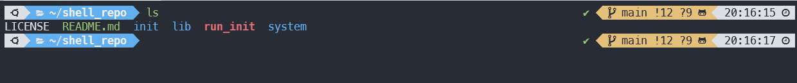

# :beers: GuangyuPeng's Shell Script Repo

1. [Overview](#Overview)
2. [Modules](#Modules)

    * [Initialization](#Initialization)
    * [System Management](#SystemManagement)
	* [Products Construction](#ProductsConstruction)

## <a name='Overview'></a>Overview

This repository contains useful shell scripts that automatically configure
a new linux system, install some common developmental tools, manage various
functions in system, install and configure some high-quality products, etc.

Note: scripts in this repository have been tested on **Ubuntu 22.04** and
**Ubuntu 20.04** system.
After cloning this repository, you should firstly set the environment variable
**SHELLREPOPATH** to the full path of `shell_repo`'s root directory, e.g.

```shell
export SHELLREPOPATH="/home/user/shell_repo"
```

## <a name='Modules'></a>Modules

### <a name='Initialization'></a>Initialization

This module helps to do some necessary work of configuration and installation
after installing a new linux, including:

* Do some basic settings such as timezone.
* Configure software mirror source.
* Install basic developmental tools.
    * use `zsh` as the default shell
    * use `Powerlevel10k` as theme of zsh
    * use `powerline` in tmux
* Install configuration files of developmental tools.
* Configure sshd to only allow key authentication and restart it.

Just run `./run_init` to initialize a new system. Users in China may need to
set proxy before running `./run_init`.
中国用户可能需要先挂代理再执行`./run_init`。

After you see `Oh my zsh`, you should execute `exit` to go on.

After initialization, the terminal will look like this:

Make sure you have installed the [Meslo Nerd Font](https://github.com/romkatv/powerlevel10k#meslo-nerd-font-patched-for-powerlevel10k)
recommended by `Powerlevel10k` and set your terminal to use this font, so that
the symbols can be printed correctly.

### <a name='SystemManagement'></a>System Management

This module includes scripts to manage various aspects of the system, such as
user management, network management, etc.

* User management: create users, delete users, etc.
* TODO

### <a name='ProductsConstruction'></a>Products Construction

This module includes scripts to install state-of-the-art products.
